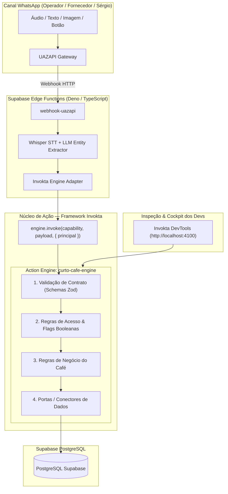

# Integração do Framework Invokta no Projeto Curto ERP
*(Action Engines & Domain Capabilities — vinilana/invokta)*

---

## 1. O que é o Invokta e seu Papel no Projeto?

O **Invokta** é um framework TypeScript para criação de **Action Engines** (motores de ação desacoplados de interface, headless e versionados). 

No projeto do **Curto Café**, o Invokta atua como a **"Cozinha Central Blindada"**:
* A **IA (LLM/Whisper)** interpreta a linguagem natural vinda do WhatsApp.
* Mas a IA **NUNCA** acessa ou grava diretamente no banco de dados.
* A IA invoca uma **Capability (Ação)** do Invokta (ex: `estoque.entrada-mercadoria`, `estoque.dar-baixa`, `compras.sugerir-reposicao`).
* O **Invokta** valida o contrato de entrada (Zod / Standard Schema), confere as regras de negócio, verifica as permissões (flags booleanas) e só então executa a persistência no PostgreSQL do Supabase.

---

## 2. Diagrama de Camadas com Invokta & Supabase

---

## 3. As 4 Responsabilidades do Invokta no Curto ERP

1. **Contratos em Tempo de Execução (Runtime Contracts):**
   * Cada ação possui schema estrito de entrada e saída.
   * Se o áudio do barista falar *"deixei café"*, mas faltar a quantidade, o Invokta barra a execução e devolve erro estruturado para a Edge Function perguntar no WhatsApp: *"Quantos pacotes de café foram entregues?"*.

2. **Segurança & Políticas com Flags Booleanas:**
   * A identidade confiável (`Principal`) é o número de telefone autenticado via webhook.
   * O Invokta aplica a regra do Sérgio: se a flag `acesso_irrestrito_global == true`, libera consultas gerais. Se for desativada no futuro, fecha dados financeiros para não-administradores sem alterar uma linha de código das ações.

3. **Retroalimentação pelo Sérgio via WhatsApp:**
   * O Sérgio pode consultar parâmetros ou alterar regras por áudio/texto no WhatsApp.
   * O comando aciona uma capability segura do Invokta (ex: `regras.atualizar-parametro`), que valida se o novo valor é plausível (ex: margem mínima válida) antes de salvar no Supabase.

4. **DevTools Pronta para os Desenvolvedores:**
   * Com o pacote `@invokta/devtools`, Neto e Fernando contam com uma interface local pronta (`npm run devtools`) para listar todas as capabilities cadastradas, testar payloads JSON e auditar o comportamento das regras sem precisar disparar mensagens no WhatsApp real.

---

## 4. Exemplos de Capabilities Mapeadas

* `estoque.entrada-mercadoria`: Recebe lista de itens, quantidades, valores e fornecedor $\rightarrow$ Valida $\rightarrow$ Grava movimentação.
* `estoque.dar-baixa-consumo`: Recebe item e quantidade consumida $\rightarrow$ Confere saldo $\rightarrow$ Debita estoque.
* `estoque.registrar-perda`: Recebe item, quantidade e motivo da quebra/avaria $\rightarrow$ Registra ocorrência.
* `estoque.consultar-saldo`: Recebe termo aproximado $\rightarrow$ Executa fuzzy matching $\rightarrow$ Retorna saldo atual.
* `regras.consultar`: Permite ao Sérgio perguntar no WhatsApp regras e parâmetros do negócio.
* `regras.atualizar`: Permite ao Sérgio atualizar preços de custo/venda e estoque de segurança por mensagem de voz.
