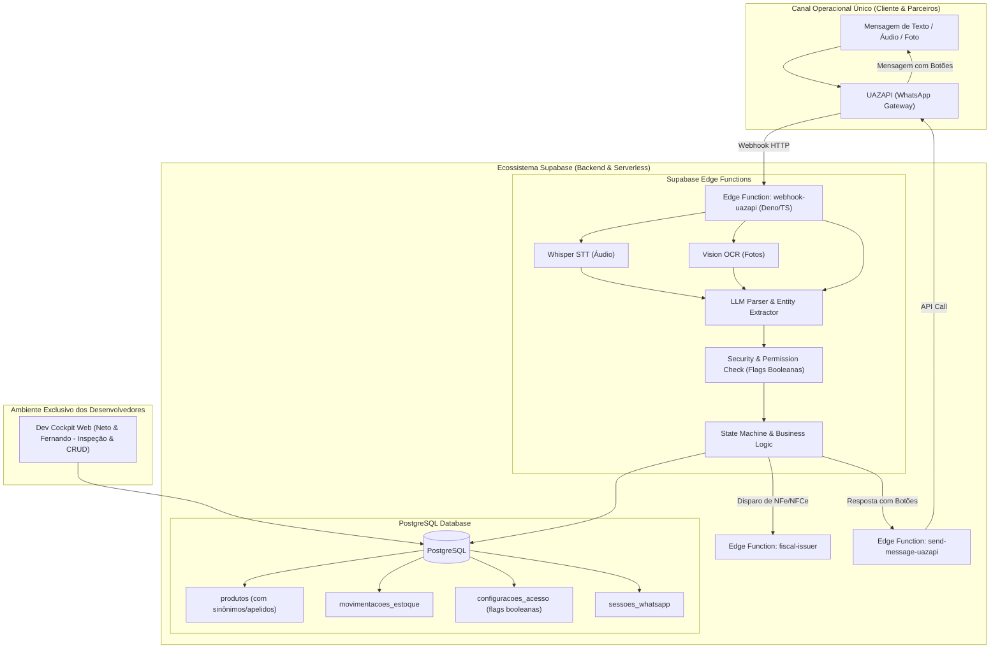

# Projeto ERP Conversacional — Curto Café & Miguez Neto Tecnologia
## Arquitetura Técnica, Diretrizes Atualizadas & Método BMAD

---

## 1. Contexto & Atualizações Estratégicas Pós-Aprovação

* **Status:** **PROJETO APROVADO PELO CLIENTE!**
* **Cliente:** Sérgio Kienteca (Curto Café).
* **Parceiros Técnicos:** Neto (CEO, Miguez Neto Tecnologia) e Fernando (Sócio Desenvolvedor).
* **Metodologia de Desenvolvimento:** **BMAD Method** (Breakthrough Method for Agile AI-Driven Development — *bmad-code-org*).
* **Próximo Passo Decisivo:** **Imersão física do Fernando na loja do Curto Café** (Centro do Rio) para mapear in loco as dores reais do balcão antes de travar a sequência exata de módulos.

---

## 2. Novas Diretrizes Arquiteturais & de Negócio

1. **100% Conversacional via WhatsApp (Zero Interface Web para o Cliente):**
   * **Nenhuma parte envolvida do cliente** (nem o Sérgio, nem fornecedores, nem garçons/baristas) utilizará interface web.
   * Toda a operação cotidiana (entradas de estoque, baixas, perdas, consultas de saldo, alertas e relatórios) ocorrerá **exclusivamente por conversa no WhatsApp (áudio, texto e fotos com botões nativos)**.
   * A interface Web será desenvolvida **exclusivamente para uso interno dos desenvolvedores (Neto & Fernando)**, funcionando como cockpit de inspeção do banco de dados, visualização de logs, depuração e testes rápidos de CRUD.

2. **Política de Acesso "Aberta por Padrão com Flag Booleana":**
   * O Sérgio determinou que neste primeiro momento a operação será transparente e sem barreiras: qualquer fornecedor ou funcionário cadastrado com telefone na base poderá consultar informações (incluindo saldo de estoque e dados financeiros).
   * **Requisito Mandatório:** O sistema deve nascer com flags booleanas configuráveis (ex: `acesso_irrestrito_global: true`, `permite_consulta_financeira: true` na tabela de configurações ou perfil), permitindo que o Sérgio restrinja os acessos no futuro a qualquer momento sem necessidade de alterar o código-fonte.

3. **Substituição Tecnológica: Supabase Edge Functions + Framework Invokta:**
   * O **N8N foi descontinuado** do projeto.
   * **Camada de Transporte e Webhooks:** Supabase Edge Functions (TypeScript / Deno).
   * **Camada de Domínio e Ações (Action Engine):** Framework **Invokta** (`vinilana/invokta`).
     * O Invokta atua como a **"Cozinha Central Blindada"**: a IA do WhatsApp nunca escreve diretamente no banco. Ela aciona Capabilities do Invokta (ex: `estoque.entrada-mercadoria`, `estoque.dar-baixa`), que validam contratos via Zod, aplicam regras de negócio e testam as flags de permissão antes de persistir no PostgreSQL.
     * Oferece o **Invokta DevTools** nativo para os desenvolvedores (Neto & Fernando) inspecionarem ações e regras em `http://localhost:4100`.

4. **Adoção do BMAD Method:**
   * Desenvolvimento ágil orientado a IA, mantendo contexto persistente, blueprints estruturados e ciclos curtos de feedback.

---

## 3. Arquitetura Proposta da Solução (Supabase Native)



---

## 4. Política de Permissões & Modelo de Flags

Para atender à exigência do Sérgio de transparência inicial com controle futuro, o banco de dados e as Edge Functions implementarão o seguinte modelo:

```sql
-- Tabela de Configurações Globais de Acesso
CREATE TABLE configuracoes_acesso (
    id UUID PRIMARY KEY DEFAULT gen_random_uuid(),
    acesso_irrestrito_global BOOLEAN DEFAULT TRUE,      -- Flag mestre: se TRUE, usuários cadastrados acessam tudo
    permite_consulta_financeira BOOLEAN DEFAULT TRUE,   -- Se FALSE, apenas Gestores veem custos/preços
    permite_consulta_estoque_geral BOOLEAN DEFAULT TRUE,-- Se FALSE, restringe visão por unidade
    atualizado_em TIMESTAMPTZ DEFAULT now()
);

-- Tabela de Usuários com permissões granulares prontas
ALTER TABLE usuarios ADD COLUMN IF NOT EXISTS permissao_financeira BOOLEAN DEFAULT TRUE;
ALTER TABLE usuarios ADD COLUMN IF NOT EXISTS permissao_estoque BOOLEAN DEFAULT TRUE;
```

* **Lógica na Edge Function:**
  ```typescript
  // Se a flag global estiver ativa, libera a consulta sem atrito
  if (config.acesso_irrestrito_global || usuario.permissao_financeira) {
      return responderConsultaFinanceira(dados);
  } else {
      return responderMensagem("🔒 Esta consulta está restrita à gestão.");
  }
  ```

---

## 5. Próximos Passos com o Método BMAD

1. **Fase 1 — Imersão & Mapeamento de Dores (Fernando na Loja Física):**
   * Acompanhamento da rotina no balcão (Edifício Cândido Mendes).
   * Levantamento dos momentos exatos em que ocorrem entradas de produtos, saídas de café, desperdícios e anotações manuais.
   * Definição da ordem prioritária dos módulos baseada na dor mais aguda observada.
2. **Fase 2 — Modelagem Supabase & Blueprints BMAD:**
   * Configuração do projeto no Supabase (Schema SQL, Triggers, RLS e Storage).
   * Estruturação dos Blueprints em TypeScript para as Edge Functions.
3. **Fase 3 — Implementação Orientada a IA (Sprints Incrementais):**
   * Construção das Edge Functions de recepção da UAZAPI, transcrição Whisper, prompts de extração e botões interativos.
4. **Fase 4 — Validação em Campo & Go-Live:**
   * Testes reais diretamente com o Sérgio e equipe pelo WhatsApp.
