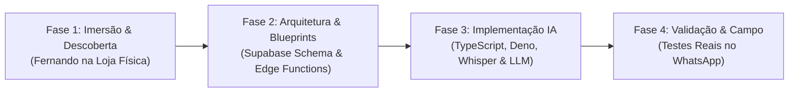

# Método BMAD — Guia de Aplicação no Projeto Curto ERP
*(Breakthrough Method for Agile AI-Driven Development — bmad-code-org)*

---

## 1. O que é o BMAD no contexto do Curto Café?
O **BMAD Method** é um framework AI-native para desenvolvimento ágil que resolve a perda de contexto e a falta de estrutura em projetos construídos com apoio de inteligência artificial.

No projeto Curto ERP, o BMAD será o fio condutor de toda a engenharia, assegurando que cada decisão técnica, prompt de IA e Edge Function do Supabase mantenha rastreabilidade e coerência com a realidade de campo da cafeteria.

---

## 2. Ciclo BMAD Adaptado para o Projeto

### Fase 1: Imersão & Descoberta (On-Site Field Research)
* **Ação:** O desenvolvedor Fernando passará um período em imersão física no balcão da Curto Café (Centro do RJ).
* **Entregáveis:**
  * Mapeamento dos fluxos reais de entrega (horários que chegam pães, doces, cafés).
  * Registro de vocabulário e gírias locais usadas pelos baristas e fornecedores.
  * Identificação da **dor número 1** da operação para definir qual módulo será desenvolvido primeiro.

### Fase 2: Arquitetura, Modelagem & Blueprints
* **Ação:** Estruturação da base no Supabase (PostgreSQL + Auth + Storage).
* **Entregáveis:**
  * Schemas de dados com suporte a sinônimos de produtos.
  * Configuração de tabelas com flags booleanas para controle futuro de acesso (`acesso_irrestrito_global`, `permite_consulta_financeira`).
  * Contratos de API e payloads das Edge Functions em TypeScript.

### Fase 3: Implementação Orientada a IA (Supabase Edge Functions)
* **Ação:** Construção das funções serverless no Supabase (Deno/TypeScript) em substituição total ao N8N.
* **Componentes:**
  1. `webhook-uazapi`: Recebe mensagens, imagens e áudios do WhatsApp.
  2. `pipeline-whisper`: Envia áudios para transcrição rápida multilíngue (pt-BR e es-PY).
  3. `pipeline-vision`: OCR para leitura de canhotos e comprovantes em papel.
  4. `nlu-parser`: Prompt com extração estruturada de JSON e fuzzy matching com o catálogo.
  5. `state-machine`: Controle de sessão para confirmação via botões interativos.
  6. `fiscal-issuer`: Disparo de emissão de NFC-e/NF-e.
  7. `dev-cockpit`: Interface web interna e restrita aos desenvolvedores (Neto & Fernando) para inspeção de banco e CRUDs de teste.

### Fase 4: Validação em Campo & Refinamento Contínuo
* **Ação:** O Sérgio e a equipe do balcão testam diretamente no WhatsApp.
* **Feedback Loop:** Ajustes nos prompts e no dicionário de sinônimos com base nos áudios reais gravados no dia a dia.

---

## 3. Matriz de Decisões Técnicas Alinhadas com o Cliente

| Item | Decisão Anterior | Nova Decisão Aprovada | Motivo / Vantagem |
| :--- | :--- | :--- | :--- |
| **Interface do Cliente** | Painel Web Operacional | **100% WhatsApp (Zero Web)** | Usuários com baixa maturidade digital operam melhor por áudio/texto no WhatsApp. |
| **Interface Web** | Acesso para Sérgio/Operação | **Apenas Cockpit Interno para Devs** | Uso exclusivo de Neto & Fernando para inspecionar banco de dados e testes CRUD. |
| **Orquestrador / Backend** | N8N Self-Hosted | **Supabase Edge Functions + Invokta** | Código TypeScript versionado, menor latência, Action Engine com validação Zod e DevTools. |
| **Camada de Ações / Regras** | Lógica solta no N8N | **Framework Invokta (vinilana/invokta)** | A IA nunca grava no banco diretamente; aciona capabilities do Invokta com contratos e permissões blindadas. |
| **Política de Acesso** | Perfis restritivos (Gestor/Op) | **Aberta por padrão com Flag Booleana** | Sérgio quer transparência inicial para equipe, com botão/flag para fechar se quiser no futuro. |
| **Ordem dos Módulos** | Definida previamente | **A definir pós-imersão do Fernando** | Garantir que o primeiro módulo ataque a dor mais crítica observada no balcão da loja. |
| **Metodologia** | Scrum genérico | **BMAD Method (bmad-code-org)** | Desenvolvimento estruturado com agentes de IA, blueprints e preservação de contexto. |
