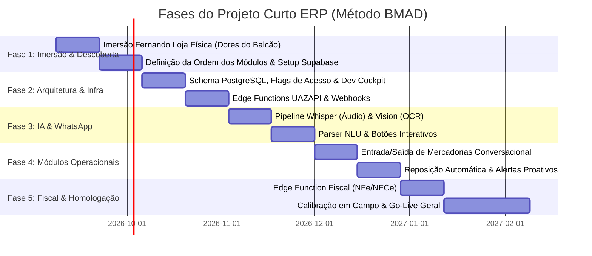

# Plano de Projeto — Curto ERP Conversacional
## Metodologia BMAD (Breakthrough Method for Agile AI-Driven Development)

## 1. Parâmetros de Gestão & Metodologia

* **Status:** **PROJETO APROVADO!**
* **Metodologia:** **BMAD Method** (AI-Native Agile Framework — *bmad-code-org*).
* **Orçamento de Horas do Projeto:** **410h** (R$ 85,00/h = R$ 34.850,00).
* **Prazo Total:** **4 a 6 meses** (Ciclos quinzenais de entrega).
* **Canal do Cliente:** **100% WhatsApp** (Zero interface web para Sérgio, equipe ou fornecedores).
* **Interface Web:** Criada **apenas internamente para os desenvolvedores (Neto & Fernando)** visualizarem o banco e realizarem testes CRUD.
* **Stack Tecnológica:** **Supabase Nativo** (PostgreSQL + Edge Functions TypeScript/Deno) + **uazapi** (WhatsApp Gateway) + **Whisper / LLMs**. *(N8N descontinuado)*.

---

## 2. Visão Geral das Fases BMAD

---

## 3. Detalhamento dos Sprints e Entregáveis

### 🟢 MÊS 1: Infraestrutura, Banco de Dados & Fundação
* **Sprint 1 (Semanas 1 e 2):**
  * Setup da VPS (Docker Compose: n8n, PostgreSQL, Redis, UAZAPI).
  * Configuração de segurança, SSL, domínio e rotinas de backup.
* **Sprint 2 (Semanas 3 e 4) — 🚀 Marco 1 (Ambiente Pronto):**
  * Modelagem das tabelas: Produtos (com tags/sinônimos), Fornecedores, Categorias, Estoques e Movimentações.
  * Estruturação da camada de backend/APIs rápidas.

---

### 🟢 MÊS 2: Interface Web Operacional (Cliente Já Começa a Usar!)
* **Sprint 3 (Semanas 5 e 6):**
  * Telas de cadastro e manutenção: Produtos, Preços (custo/venda), Fornecedores e Contatos.
  * **Internacionalização (i18n):** Suporte completo para alternar idioma entre **Português (pt-BR)** e **Espanhol do Paraguai (es-PY)** + campos de moedas (R$ e ₲ / US$).
  * O Sérgio e o Renato já recebem acesso para popular o catálogo real das operações Brasil e Paraguai.
* **Sprint 4 (Semanas 7 e 8) — 🚀 Marco 2 (Release Web Operacional):**
  * Telas simples de movimentação: Entrada de mercadorias, baixa manual, ajuste de saldo e consulta de estoque atual.
  * **Entrega Parcial 1:** ERP Web 100% operacional no ar (bilíngue). A empresa já consegue fazer inventário inicial e controlar estoque pela interface.

---

### 🟢 MÊS 3: WhatsApp Gateway (UAZAPI) & Motor de IA
* **Sprint 5 (Semanas 9 e 10):**
  * Conexão e pareamento da UAZAPI com o número de WhatsApp da empresa.
  * Webhooks configurados no n8n para recepção de texto, áudio e fotos.
  * Envio de mensagens estruturadas com botões interativos nativos (`Quick Reply`).
* **Sprint 6 (Semanas 11 e 12) — 🚀 Marco 3 (Bot Básico Ativo):**
  * Integração Whisper configurada para transcrição em **Português e Espanhol (es-PY)**.
  * NLU/LLM com *Fuzzy Matching* bilíngue conectado ao banco de dados já populado pelo cliente.
  * **Entrega Parcial 2:** Bot que transcreve áudio em pt-BR/es-PY, localiza produtos no banco e responde com botões no idioma correto.

---

### 🟢 MÊS 4: Estoque Conversacional & Reposição Automática
* **Sprint 7 (Semanas 13 e 14):**
  * Fluxo completo de Entrada por Áudio/Foto de Notas $\rightarrow$ Botão `[✅ Confirmar]` $\rightarrow$ Atualização imediata do estoque.
  * Fluxo de Baixa de Consumo e Perdas do balcão por mensagem de voz.
* **Sprint 8 (Semanas 15 e 16) — 🚀 Marco 4 (Release Conversacional):**
  * Gatilhos automáticos de estoque de segurança no n8n.
  * Alertas no WhatsApp do Sérgio: *"Estoque de café 250g baixo"* com botão `[📦 Pedir 50 pacotes]`.
  * **Entrega Parcial 3:** Operação pelo WhatsApp 100% conectada ao painel web.

---

### 🟢 MÊS 5: Módulo Fiscal Simplificado (NFe / NFCe)
* **Sprint 9 (Semanas 17 e 18):**
  * Integração da API Fiscal (Focus NFe ou Nuvem Fiscal) no n8n.
  * Mapeamento de regras tributárias e regimes em conjunto com o Renato (contador).
* **Sprint 10 (Semanas 19 e 20) — 🚀 Marco 5 (Emissão Fiscal Ativa):**
  * Disparo automático de emissão fiscal e envio de PDF/XML no WhatsApp ou download no painel web.
  * **Entrega Parcial 4:** Emissão de notas fiscais operando sem atrito.

---

### 🟢 MÊS 6: Homologação Integrada, Treinamento & Go-Live Geral
* **Sprint 11 (Semanas 21 e 22):**
  * Testes de estresse com o time de balcão (Edifício Cândido Mendes) usando web e WhatsApp simultaneamente.
  * Calibração de prompts para ruídos de cafeteria e termos regionais.
* **Sprint 12 (Semanas 23 e 24) — 🚀 Go-Live Oficial:**
  * Treinamento final, documentação simplificada e encerramento do projeto com estabilização.

---

## 4. Cerimônias Scrum Adaptadas para o Cliente

* **Sprint Planning (Quinzenal - Interno Neto & Fernando):** Planejamento dos nós do n8n, tabelas e prompts das próximas 2 semanas.
* **Sprint Review / Demo com o Sérgio (Mensal ou Quinzenal):** Apresentação prática no WhatsApp mostrando as novas funcionalidades prontas para uso real.
* **Continuous Feedback:** O Sérgio e os baristas testam no próprio grupo de WhatsApp durante a semana e dão feedback imediato.
