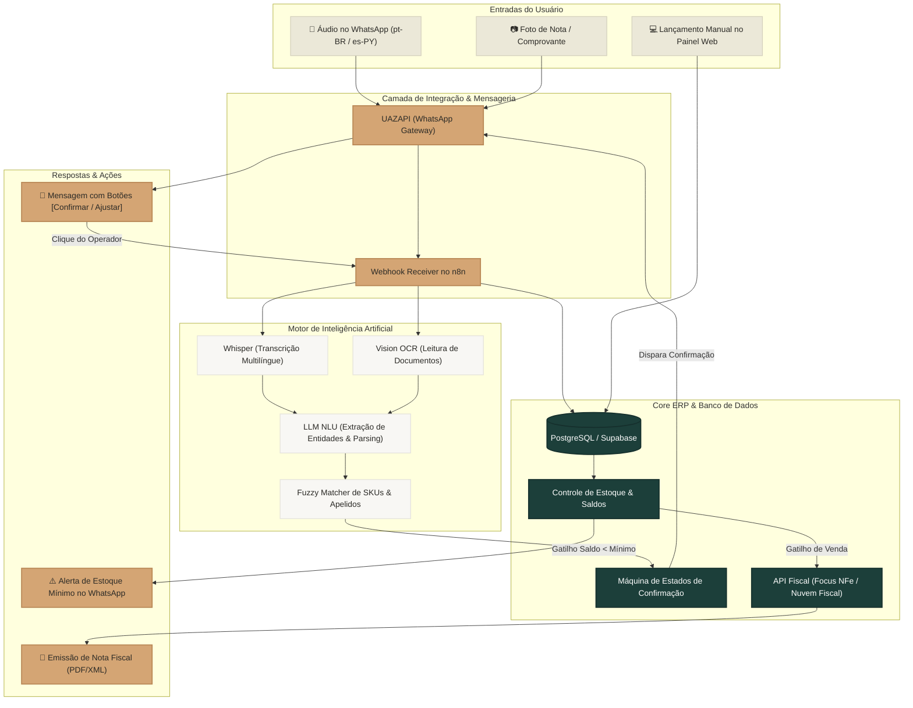
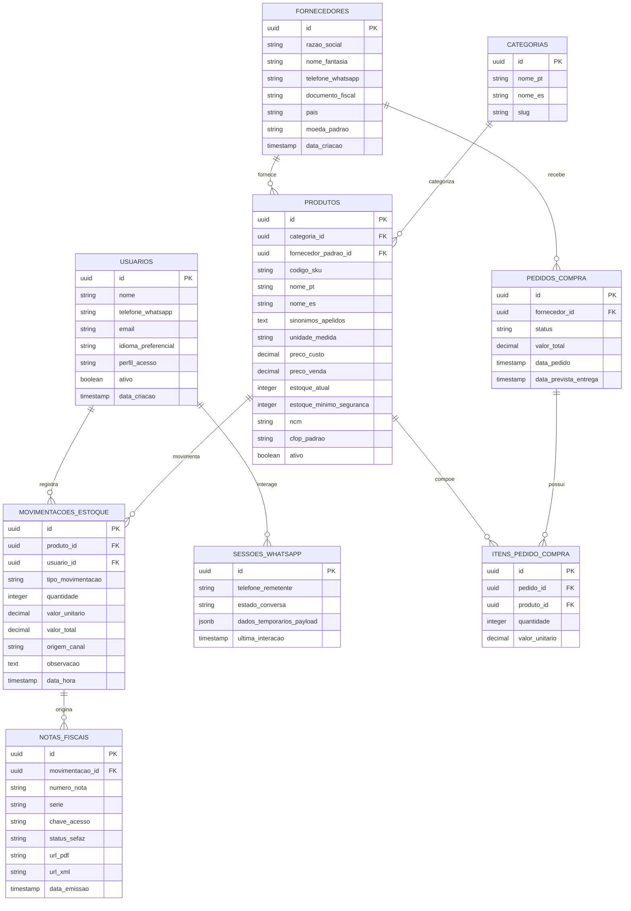

# ☕ Curto Café — ERP Conversacional & Colaborativo
**Documento de Requisitos de Produto (PRD), Arquitetura, Benchmark e Proposta Técnica**

---

# PRD (Product Requirements Document)

## [1] Nome do Projeto
**Curto ERP Conversacional** *(Gestão de Estoque, Compras e Operação via WhatsApp + IA + Web)*

---

## [2] Visão Geral do Sistema
O **Curto ERP Conversacional** é um sistema de gestão desenhado especificamente para a realidade operacional do **Curto Café** (Brasil e Paraguai). Ele une a facilidade e agilidade de uma interface conversacional no **WhatsApp** (com áudio, fotos e botões interativos via IA) a uma base sólida de **ERP Web administrativo** e controle de estoque distribuído.

Diferente dos ERPs tradicionais de mercado — pesados, burocráticos e com alta curva de aprendizado —, o Curto ERP foi concebido para que pessoas com **baixa maturidade digital** (baristas, fornecedores artesanais e ajudantes de operação) consigam alimentar entradas de mercadorias, dar baixas de consumo e consultar saldos através de **mensagens de voz ou fotos de comprovantes no WhatsApp**, com validação em 1 clique via botões interativos.

A solução opera de forma descentralizada, com suporte nativo bilíngue (**Português do Brasil** e **Espanhol do Paraguai**), respeitando a filosofia de software livre, transparência de processos e colaboração em rede.

---

## [3] Objetivos da Primeira Versão (v1)
* **Zero Fricção no Balcão:** Permitir que operadores e fornecedores registrem entradas e baixas de mercadorias em menos de 10 segundos via áudio ou foto no WhatsApp.
* **Base Web Operacional Imediata (Web-First):** Disponibilizar em até 60 dias o painel web para cadastro de produtos, preços (custo e venda), fornecedores e controle de saldos.
* **Precisão na Reposição:** Automatizar o cálculo de estoque mínimo e disparar alertas acionáveis no WhatsApp para compra/torra de café antes da ruptura.
* **Operação Internacional Unificada:** Garantir suporte bilíngue completo (pt-BR e es-PY) e controle multimoeda (BRL e PYG/USD).
* **Emissão Fiscal Sem Burocracia:** Emitir documentos fiscais (NFC-e / NF-e) através de gatilhos automáticos integrados a API fiscal.

---

## [4] Personas Prioritárias

1. **Sérgio (Gestor Geral / Fundador):**
   * *Necessidade:* Visão clara de estoque, alertas de reposição no WhatsApp, controle de margens e precificação segura, sem perder tempo preenchendo planilhas complexas.
2. **Barista / Operador de Balcão (Brasil e Paraguai):**
   * *Necessidade:* Registrar que um bolo quebrou, que um saco de café foi aberto ou que um fornecedor entregou pães/brownies apenas enviando um áudio rápido no WhatsApp.
3. **Fornecedor Artesanal Local:**
   * *Necessidade:* Avisar a entrega de produtos (ex: "Deixei 30 brownies") e receber na hora a confirmação formal com recibo digital no WhatsApp.

---

## [5] Funcionalidades Essenciais (MVP)

### 🖥️ Módulo Web Administrativo (Cockpit de Gestão)
* **Autenticação & Perfis:** Acesso seguro com perfis de Gestor e Operador.
* **Catálogo de Produtos:** Cadastro de SKU, unidade de medida, preço de custo, preço de venda, estoque mínimo de segurança e **campo de sinônimos/apelidos** (para IA).
* **Gestão de Fornecedores:** Cadastro de parceiros com número de WhatsApp vinculado para identificação automática.
* **Movimentações de Estoque:** Telas para entrada manual, saída, ajuste de inventário e registro de perdas.
* **Internacionalização (i18n):** Seletor no topo da tela (Português pt-BR / Español es-PY) e suporte a moedas (R$ e ₲ / US$).

### 📱 Módulo Conversacional WhatsApp (UAZAPI + IA)
* **Entrada de Mercadoria por Áudio:** O fornecedor ou barista envia áudio → Whisper transcreve → LLM extrai itens e quantidades → Sistema envia mensagem com **Botões Interativos** (`[✅ Confirmar]`, `[✏️ Ajustar]`, `[❌ Cancelar]`) → Ao clicar, credita estoque.
* **Entrada por Foto de Documento (OCR):** Envio de foto de canhoto, nota de entrega ou recibo de papel → IA lê os itens e monta a confirmação com botões.
* **Baixa Rápida de Consumo e Perdas:** Comando de voz simples (ex: *"abrimos 2 sacos de café 1kg"* ou *"estragou 1 torta"*).
* **Consulta Rápida de Saldo:** Pergunta informal no WhatsApp (ex: *"quantos pacotes de café moído temos?"*) respondida em tempo real.
* **Alertas de Reposição Automática:** Mensagem proativa quando o estoque atingir o nível de alerta, com botão `[📦 Pedir Reposição]`.

### 🧾 Módulo Fiscal Descomplicado
* **Integração com API Fiscal (Focus NFe / Nuvem Fiscal):** Parametrização prévia de NCM e tributos.
* **Emissão em 1 Toque:** Emissão assíncrona com link do PDF e XML disponibilizados no WhatsApp ou no painel.

---

## [6] Fluxo Principal do Usuário

```
[Fornecedor / Barista] 
       │ (Envia Áudio: "Deixei 40 brownies tradicionais a R$ 4,00")
       ▼
[WhatsApp / UAZAPI Gateway] 
       │ (Webhook)
       ▼
[Motor de IA: Whisper + NLU] 
       │ (Identifica Fornecedor, Produto "Brownie Tradicional", Qtd 40, Total R$ 160)
       ▼
[Mensagem WhatsApp com Botões] 
       │ "📦 Entrada Identificada: 40x Brownie Tradicional. Total: R$ 160,00"
       │ [ Botão: ✅ Confirmar ]  [ Botão: ✏️ Ajustar ]  [ Botão: ❌ Cancelar ]
       ▼
[Operador Clica: ✅ Confirmar]
       │
       ▼
[ERP / Banco de Dados] ───► Atualiza Saldo de Estoque + Registra Contas a Pagar
       │
       ▼
[WhatsApp] ───► "✅ Estoque atualizado com sucesso! Saldo atual: 45 unidades."
```

---

## [7] Requisitos Não-Funcionais
* **Disponibilidade & Performance:** Processamento de áudios no WhatsApp e retorno com botões em **menos de 5 segundos (Dependendo do tamanho do áudio)**.
* **Tolerância a Ruídos:** Transcrição precisa mesmo com barulho característico de cafeterias e tráfego de pessoas.
* **Segurança e Privacidade:** Sessões de WhatsApp com tokens seguros e banco de dados PostgreSQL com **backups periódicos do Banco de Dados**.
* **Arquitetura Aberta (Open-Source Friendly):** Estruturação em nós modulares no **N8N** para total autonomia e facilidade de alteração de regras sem depender de código compilado fechado.
* **Idioma & Dialeto:** Compreensão de português brasileiro, espanhol do Paraguai e variações de gírias/portunhol.

---

## [8] Itens Fora do Escopo (v1)
* Aplicativo mobile nativo para download em lojas (Google Play / App Store).
* Integração com sistema da Contabilidade.
* Módulo complexo de folha de pagamento ou contabilidade avançada (foco é estoque, compras e operação).
* Hardware ou sensores de RFID integrados fisicamente (preparado na arquitetura para v2).
* Checkout e cobrança de cartão de crédito no WhatsApp (mantém pagamentos no balcão / Pix / boleto).

---

## [9] Indicadores de Sucesso (KPIs da v1)
* **Tempo de Lançamento:** Redução de >80% no tempo gasto para registrar entradas de mercadorias no balcão.
* **Acurácia do Motor de IA:** Mais de **92% de acerto** na identificação automática de produtos a partir de áudios informais.
* **Adesão Operacional:** 100% dos lançamentos diários de insumos e cafés sendo feitos via WhatsApp sem necessidade de suporte técnico.
* **Zero Ruptura Crítica:** Eliminação de episódios de falta inesperada de grãos de café nas unidades.

---

# 🔍 Benchmark de Mercado & Concorrentes

A análise a seguir compara o ecossistema proposto para o Curto Café com as principais soluções existentes no mercado nacional e internacional:

| Solução / ERP | Canal Principal | Interface c/ IA (Áudio/Foto) | Amigável p/ Baixa Instrução | Operação Colaborativa / Rede | Suporte Bilíngue Nativo | Custo & Flexibilidade |
| :--- | :---: | :---: | :---: | :---: | :---: | :---: |
| **ERPs Tradicionais de Varejo** *(Totvs, Linx, Alterdata)* | Desktop / Telas complexas | ❌ Não possui | ❌ Muito baixa (dezenas de campos e telas densas) | ❌ Rígido e centralizado | ⚠️ Módulos caros e engessados | 🔴 Licenciamento caro, mensalidades altas e suporte lento |
| **Sistemas Cloud PME** *(ContaAzul, Bling, Tiny)* | Web Browser | ❌ Não possui (apenas formulários web) | ⚠️ Média (exige treinamento prévio) | ❌ Focado em uma única empresa individual | ❌ Apenas pt-BR | 🟡 Preço acessível, mas fechado para customizações |
| **Bots de WhatsApp Tradicionais** *(Chatbots de Menu 1, 2, 3)* | WhatsApp | ❌ Sem IA contextual (árvores rígidas de opções) | ⚠️ Baixa (se errar um número o fluxo quebra) | ❌ Apenas atendimento ao cliente | ❌ Engessado | 🟡 Barato, mas inútil para controle de estoque |
| **🚀 Curto ERP Conversacional** *(Solução Proposta)* | **WhatsApp (Voz, Foto, Botões) + Web Simples** | **✅ Whisper + LLM + OCR nativos** | **⭐ Máxima (1 toque em botões nativos)** | **✅ Feito para rede distribuída (BR + PY)** | **✅ pt-BR e es-PY nativos** | **🟢 Base N8N livre, sem custo de licença proprietária e 100% customizável** |

### 💡 Insights e Vantagens Competitivas (O Diferencial Curto Café):
1. **Nenhum concorrente une ERP + WhatsApp com IA de Voz para Gestão Interna:** Quase todos os chatbots de WhatsApp são focados em vender para o cliente final (SAC/Vendas). O Curto ERP inova ao usar a IA para desburocratizar a **operação interna e os fornecedores**.
2. **Eliminação do "Gargalo da Planilha":** Soluções convencionais falham porque o operador esquece de abrir o computador para lançar o estoque. Com o WhatsApp no bolso, o registro ocorre no instante em que a mercadoria chega.
3. **Liberdade Tecnológica:** A arquitetura em N8N + PostgreSQL garante que o Curto Café nunca fique refém de fornecedores com mensalidades abusivas por usuário.

---

# 🗺️ Mapa de Telas (Interface Web)

1. **Tela de Autenticação / Login:**
   * Login simples por e-mail/senha com seletor de idioma (Português / Español).
2. **Dashboard Operacional:**
   * Indicadores em cartões limpos: Total de itens em estoque, produtos em nível crítico de reposição, últimas entradas e alertas do dia.
3. **Catálogo de Produtos & Preços:**
   * Listagem com busca inteligente, cadastro de SKU, unidade (kg, un, pacote), preço de custo, preço de venda, estoque mínimo e **tags/apelidos para IA**.
4. **Gestão de Fornecedores & Parceiros:**
   * Cadastro de nome, telefone WhatsApp, chave Pix/dados bancários e produtos fornecidos.
5. **Movimentações & Ajuste de Estoque:**
   * Tabela cronológica de movimentações (Entradas, Saídas, Perdas e Ajustes) com filtros por data, produto e operador.
6. **Central de Alertas & Reposição:**
   * Lista de itens com estoque baixo e botão para envio de ordem de compra direta para o fornecedor.
7. **Fila de Exceções da IA:**
   * Histórico de mensagens do WhatsApp que tiveram divergência ou necessitam de revisão humana rápida.
8. **Relatórios Fiscais & Exportação:**
   * Consulta de notas emitidas e download de XML/PDF para apoio contábil.

---

# 🔄 Fluxograma do Sistema (Mermaid)



---

# 🗄️ Estrutura do Banco de Dados (PostgreSQL / Supabase)

## Diagrama Entidade-Relacionamento (ERD Mermaid)



---

## Tabelas Detalhadas

### Tabela: `usuarios`
| Campo | Tipo | Descrição |
| :--- | :--- | :--- |
| `id` | UUID (PK) | Identificador único do usuário |
| `nome` | VARCHAR(120) | Nome do colaborador ou operador |
| `telefone_whatsapp` | VARCHAR(25) | Número formatado com DDI/DDD (usado na identificação) |
| `email` | VARCHAR(120) | E-mail de acesso ao painel web |
| `idioma_preferencial` | VARCHAR(5) | `pt-BR` ou `es-PY` |
| `perfil_acesso` | VARCHAR(20) | `GESTOR`, `OPERADOR`, `CONTADOR` |
| `ativo` | BOOLEAN | Status do usuário no sistema |
| `data_criacao` | TIMESTAMPTZ | Data e hora de criação do registro |

### Tabela: `produtos`
| Campo | Tipo | Descrição |
| :--- | :--- | :--- |
| `id` | UUID (PK) | Identificador único do produto |
| `categoria_id` | UUID (FK) | Categoria do produto |
| `codigo_sku` | VARCHAR(50) | Código de referência interno |
| `nome_pt` | VARCHAR(150) | Nome em português (ex: Café Microlote 250g Grãos) |
| `nome_es` | VARCHAR(150) | Nome em espanhol (ex: Café Microlote 250g Granos) |
| `sinonimos_apelidos` | TEXT | Termos/gírias para a IA (ex: *"grao 250, cafe graos, pacote pequeno"*) |
| `unidade_medida` | VARCHAR(10) | `UN`, `KG`, `PCT`, `L` |
| `preco_custo` | NUMERIC(12,2) | Valor de custo unitário |
| `preco_venda` | NUMERIC(12,2) | Preço praticado no balcão / venda |
| `estoque_atual` | INTEGER | Saldo físico atual em estoque |
| `estoque_minimo_seguranca` | INTEGER | Ponto de gatilho para alerta de reposição |
| `ncm` | VARCHAR(10) | Código NCM para emissão fiscal |
| `ativo` | BOOLEAN | Produto ativo para venda e estoque |

### Tabela: `movimentacoes_estoque`
| Campo | Tipo | Descrição |
| :--- | :--- | :--- |
| `id` | UUID (PK) | Identificador da movimentação |
| `produto_id` | UUID (FK) | Produto movimentado |
| `usuario_id` | UUID (FK) | Usuário responsável pelo lançamento |
| `tipo_movimentacao` | VARCHAR(20) | `ENTRADA`, `SAIDA_CONSUMO`, `PERDA_AVARIA`, `AJUSTE_INVENTARIO` |
| `quantidade` | INTEGER | Quantidade movimentada (positiva ou negativa) |
| `valor_unitario` | NUMERIC(12,2) | Valor unitário na operação |
| `valor_total` | NUMERIC(12,2) | Quantidade $\times$ Valor Unitário |
| `origem_canal` | VARCHAR(20) | `WHATSAPP_AUDIO`, `WHATSAPP_FOTO`, `WHATSAPP_TEXTO`, `PAINEL_WEB` |
| `observacao` | TEXT | Texto transcrito original ou nota do operador |
| `data_hora` | TIMESTAMPTZ | Timestamp do registro |

### Tabela: `sessoes_whatsapp`
| Campo | Tipo | Descrição |
| :--- | :--- | :--- |
| `id` | UUID (PK) | Identificador da sessão |
| `telefone_remetente` | VARCHAR(25) | Número que enviou a mensagem |
| `estado_conversa` | VARCHAR(50) | Estado atual (`AGUARDANDO_CONFIRMACAO_ENTRADA`, etc.) |
| `dados_temporarios_payload` | JSONB | Estrutura extraída pela IA antes da confirmação |
| `ultima_interacao` | TIMESTAMPTZ | Timestamp para expiração de sessão |

---

## ⚡ Regras de Performance e Escala (Supabase / Postgres)
1. **Índices Estratégicos Obrigatórios:**
   * `produtos.codigo_sku`, `produtos.ativo`
   * `movimentacoes_estoque.produto_id`, `movimentacoes_estoque.data_hora`
   * `usuarios.telefone_whatsapp`
   * `sessoes_whatsapp.telefone_remetente`
2. **Busca Textual Acelerada (Trigram Index / Full-Text):**
   * Criação de índice `GIN` no campo `sinonimos_apelidos` para suportar buscas aproximadas (*fuzzy search*) em milissegundos.

---

# 🎨 Identidade Visual & Paleta de Cores do Curto Café

A interface web e os templates do sistema respeitarão rigorosamente o guia de estilo e as cores oficiais da marca:

| Amostra de Cor | Nome da Cor | Código HEX | Aplicação no Sistema |
| :---: | :--- | :---: | :--- |
| 🟩 | **Verde Curto (Floresta)** | `#1C3F3A` | Botões principais (CTAs), cabeçalhos, destaques e identidade primária. |
| 🌾 | **Areia Natural** | `#EBE8D8` | Cards de destaque, badges de status, fundos secundários suaves. |
| 🥛 | **Off-White Puro** | `#F8F7F4` | Fundo principal das telas (clean, descansado e elegante). |
| 🟤 | **Caramelo Torra** | `#D4A574` | Indicadores de alerta, selos de destaque, gráficos e detalhes visuais. |
| ⬛ | **Grafite Profundo** | `#2B2A26` | Tipografia principal, títulos, bordas e ícones contrastantes. |
| 🔲 | **Cinza Neutro** | `#4A4841` | Textos de apoio, legendas e descrições secundárias. |

* **Tipografia:** Família sem serifa moderna (**Manrope** para textos de corpo e **Barlow Condensed** para números, códigos e títulos de destaque).

---

# 📊 Matriz de Esforço, Prazos e Investimento

A matriz abaixo detalha o escopo de trabalho distribuído ao longo dos **4 a 6 meses de projeto** (12 Sprints quinzenais), dimensionado para uma equipe de 2 desenvolvedores especialistas (**Neto & Fernando**), com dedicação de ~20h semanais conjuntas e suporte contínuo:

| Módulo / Pacote de Entrega | Duração Estimada | Esforço Técnico (Horas) | Entrega Tangível para o Cliente |
| :--- | :---: | :---: | :--- |
| **1. Infraestrutura, Setup & Modelagem de Dados** | Mês 1 *(Sprints 1 e 2)* | **60h** | Servidor VPS configurado com Docker, PostgreSQL/Supabase, Redis, N8N e banco de dados pronto e indexado. |
| **2. Interface Web Operacional (Web-First)** | Mês 2 *(Sprints 3 e 4)* | **80h** | **🚀 Sistema Web no ar:** Telas de produtos, preços, fornecedores e lançamentos manuais com suporte a pt-BR e es-PY. |
| **3. WhatsApp Gateway (UAZAPI) & Transcrição IA** | Mês 3 *(Sprints 5 e 6)* | **70h** | Pareamento do WhatsApp, motor Whisper para áudios bilíngues e envio de mensagens com botões interativos nativos. |
| **4. Motor de IA, Estoque Conversacional & Reposição** | Mês 4 *(Sprints 7 e 8)* | **80h** | Entradas por áudio/foto de notas + confirmação em 1 toque + alertas automáticos de estoque mínimo no WhatsApp. |
| **5. Módulo Fiscal Simplificado (NFe/NFCe)** | Mês 5 *(Sprints 9 e 10)* | **60h** | Emissão automática de notas fiscais via API Fiscal com envio direto do link e PDF no WhatsApp. |
| **6. Calibração em Campo, Treinamento & Go-Live** | Mês 6 *(Sprints 11 e 12)* | **60h** | Testes no balcão da loja física, ajuste fino de prompts para barulhos/gírias, treinamento dos baristas e entrega final. |
| **TOTAL CONSOLIDADO** | **4 a 6 Meses** | **410h** | **Ecossistema Completo Operando em Produção (Web + WhatsApp + IA + Fiscal)** |

---

### 💼 Condições e Diferenciais da Parceria

1. **Sugestão de Pagamento por Marcos:**
   * **Entrada de Início (Setup & Banco):** 20% (R$ 6.970,00) - Sinal para início do desenvolvimento.
   * **Marco 2 (ERP Web Operacional no ar):** 20% (R$ 6.970,00)
   * **Marco 3 (WhatsApp Gateway + Whisper IA):** 20% (R$ 6.970,00)
   * **Marco 4 (Estoque Conversacional & Alertas):** 20% (R$ 6.970,00)
   * **Marco 5 (Módulo Fiscal + Go-Live Final):** 20% (R$ 6.970,00)
2. **Entregas Parciais Quinzenais:** O Sérgio não espera 6 meses para ver resultados; a cada 15 dias uma funcionalidade pronta é colocada em teste real.
3. **Propriedade Total da Solução:** Todo o código, fluxos do N8N e banco de dados pertencem ao Curto Café, sem cobrança de royalties ou taxas por usuário cadastrado.
4. **Suporte & Ajustes Rápidos:** Como a orquestração é construída no N8N, novos produtos ou alterações nas regras do WhatsApp são atualizados em minutos.
